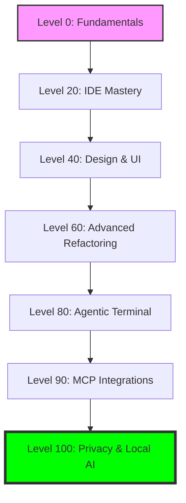

# 🚀 AI Developer Playbook

Welcome to the **AI Developer Playbook**! This repository is a curated, level-based guide for software developers to transition from manual coding to AI-augmented engineering.

---

## 🗺️ The Learning Path

---

## 🎓 Sequential Roadmap (Level 0 → 100)

### 🟢 Level 0-20: Foundational Mastery
- **[01-ai-fundamentals](01-ai-fundamentals/)** 
    - [01-ai-glossary-and-mindset.md](01-ai-fundamentals/01-ai-glossary-and-mindset.md) - LLMs, Tokens, and the AI mindset.
    - [02-first-prompts.md](01-ai-fundamentals/02-first-prompts.md) - 5 core beginner workflows.

- **[02-ide-context-and-rules](02-ide-context-and-rules/)** 
    - [.cursorrules](02-ide-context-and-rules/.cursorrules), [.github/copilot-instructions.md](02-ide-context-and-rules/.github/copilot-instructions.md) - IDE optimization.
    - [02-architecture-md-template.md](02-ide-context-and-rules/02-architecture-md-template.md) - Documenting for AI agents.

### 🟡 Level 40-60: Productivity & Refactoring
- **[03-design-and-ui-workflows](03-design-and-ui-workflows/)** 
    - [01-figma-and-vision-prompts.md](03-design-and-ui-workflows/01-figma-and-vision-prompts.md) - Design-to-code for Compose, React Native, & Flutter.

- **[04-advanced-refactoring](04-advanced-refactoring/)** 
    - [01-multi-file-refactoring.md](04-advanced-refactoring/01-multi-file-refactoring.md) - Migrating REST to GraphQL and large-scale refactors.

### 🔴 Level 80-100: The AI Power User
- **[05-agentic-terminal-tools](05-agentic-terminal-tools/)** 
    - [01-terminal-agents-guide.md](05-agentic-terminal-tools/01-terminal-agents-guide.md) - Aider, Claude Code, and autonomous debugging.

- **[06-mcp-and-integrations](06-mcp-and-integrations/)** 
    - [01-mcp-setup-guide.md](06-mcp-and-integrations/01-mcp-setup-guide.md) - Connecting AI to DBs, Figma, and GitHub.

- **[07-local-ai-and-privacy](07-local-ai-and-privacy/)** 
    - [01-running-local-llms.md](07-local-ai-and-privacy/01-running-local-llms.md) - Ollama, vLLM, and offline coding.

---

## ⚡ Quick-Start Guide

Select your current path based on your goals:

| Experience Level | Focus Area | Start Here |
| :--- | :--- | :--- |
| **Total Beginner** | Understanding & Basics | [Fundamentals](01-ai-fundamentals/01-ai-glossary-and-mindset.md) |
| **Productivity Seeker** | UI & Refactoring | [Design Workflows](03-design-and-ui-workflows/01-figma-and-vision-prompts.md) |
| **Enterprise / Privacy** | Security & Context | [Local AI](07-local-ai-and-privacy/01-running-local-llms.md) & [Architecture](02-ide-context-and-rules/02-architecture-md-template.md) |
| **AI Power User** | Agents & Tools | [Terminal Agents](05-agentic-terminal-tools/01-terminal-agents-guide.md) |

---
*Disclaimer: This playbook is a living document. As the field of AI evolves, so will these guides.*
